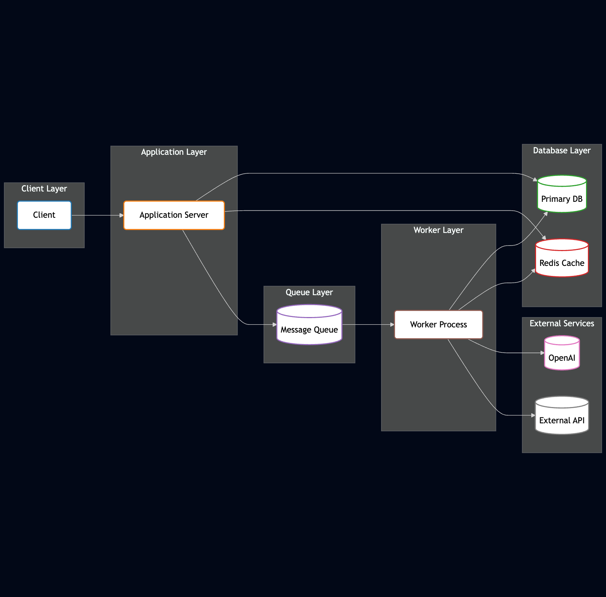

# 🚀 Koch Service Specification Transformer

## Starting 
#### create .env file
`cp local.env .env`
Add your OPENROUTE_API_KEY to the .env
Add your OPENAI_API_KEY to .env

#### activate envirnment
`poetry env activate`

#### install dependencies
`poetry install`

#### start docker compose 
`docker compose up -d`

#### start the server
`export PROCESS=server`
`./run.sh`

#### start worker
`export PROCESS=worker`
`./run.sh`

## Architecure image:

## The Digital Alchemist's Quest

*Where PDFs become gold*  
*Service specs transformed, behold!*  
*Time once lost, now reclaimed*  
*Koch's challenge awaits, untamed.*

## 🔍 The Challenge We Face

*Complex documents, dense with text*  
*Manual extraction leaves experts vexed*  
*From chaotic pages to structured rows*  
*The path to answers, AI now shows.*

Service specification documents (Leistungsverzeichnis) contain valuable information that, when properly extracted, can streamline business operations. Currently, the process of converting these documents into actionable quotation items for ERP systems is:

- Time-consuming
- Error-prone
- Inconsistent
- A significant bottleneck in sales workflows

## 🎯 Our Mission

*Upload, transform, classify, export*  
*From PDF chaos to data cohort*  
*Products and services neatly arranged*  
*The document landscape, forever changed.*

We're building an intelligent interface where users can:

1. Upload service specification documents of varying formats and structures
2. Automatically extract relevant content using OpenAI models
3. Classify extracted items as either "products" or "services"
4. Edit, refine, and customize the extracted items
5. Export structured XML files ready for ERP integration

## 📊 Our Foundation

*Catalogs of knowledge at our side*  
*Sample documents as our guide*  
*Mappings that connect the dots*  
*Together forming our strategic plots.*

Our solution leverages:

- Sample service specification document PDFs
- Company product and service catalogs
- Quotation Item Type (Class) to Article Number Mapping
- ERP integration format specifications

## 🏆 Victory Defined

*Eighty percent accuracy, our minimal aim*  
*Highlighting sections with precision, our claim*  
*User control to select, deselect, refine*  
*XML export, structured and divine.*

A successful implementation will:

- Extract and highlight relevant document sections with ≥80% accuracy
- Classify items as "product" or "service" with ≥80% precision
- Provide intuitive user controls for selection and editing
- Generate clean, structured XML files ready for ERP import

## 💡 Guiding Principles

*Non-technical users, our final judge*  
*Interfaces clear, that need not budge*  
*Feedback loops that guide the way*  
*Simplicity and power, on display.*

Our approach prioritizes:

- User-friendly interfaces for non-technical staff
- Clear visual feedback during extraction and processing
- Confidence scores for extracted information
- Efficient workflows that minimize manual intervention

## 🛠️ Technical Implementation

*OpenAI's models, our foundation strong*  
*PDF processing, where we belong*  
*Document structures analyzed with care*  
*Machine learning magic, beyond compare.*

Our technical stack includes:

- OpenAI models for text analysis and extraction
- PDF processing libraries for document parsing
- Classification algorithms for product/service identification
- XML generation tools for standardized outputs

## 🔄 Workflow Overview

*Upload a document, the journey begins*  
*AI works its magic within*  
*Review, edit, perfect the yield*  
*Export to ERP, the cycle sealed.*

1. **Document Upload**: Accept service specification PDFs
2. **Intelligent Extraction**: Identify key information and structure
3. **Classification**: Categorize items appropriately
4. **User Review**: Interface for verification and modification
5. **Export**: Generate ERP-compatible XML output

## 🌟 Join the Transformation

*PDFs no longer a burden to bear*  
*Efficiency and accuracy everywhere*  
*Koch's challenge met with innovative might*  
*Document transformation, our digital right.*

Let's revolutionize how service specifications become actionable business data. Together, we'll bridge the gap between complex documents and streamlined workflows.

---

*Where once stood frustration*  
*Now stands automation*  
*Koch's vision realized*  
*The future synthesi